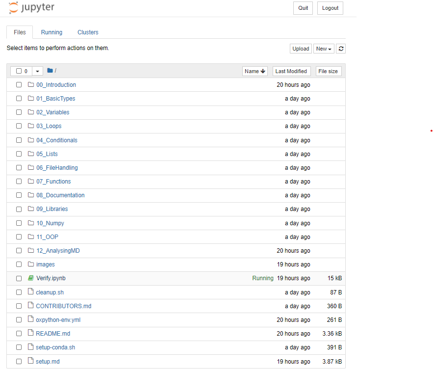
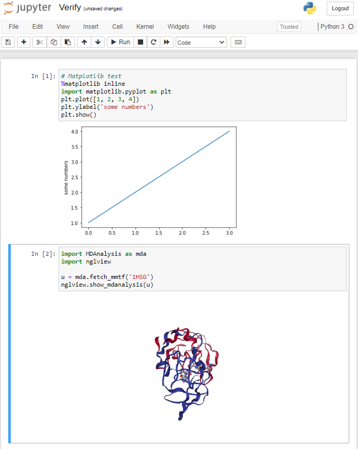

# Setup instructions for the Oxford Computational Biochemistry Python course

Navigation: [return to main setup page](../../setup.md)

Included here are instructions to help you get started with the Oxford
Computational Biochemistry Python course. The instructions are split into
two parts:

1. Setup

These instructions should be followed prior to the tutorial. These will walk
you through creating the appropriate conda environment for the tutorial and
testing that everything works as expected.

2. Starting the tutorial

These instructions should be followed on the day of / when starting the tutorial.
We assume here that you have completed the setup instructions on the same machine
and that testing passed as expected.


## 1. Setup

Here we assume you have completed the main setup instructions and have done the
following:

1. You have installed an anaconda distribution
2. You have access to a terminal
3. You have downloaded the contents of this tutorial locally.


### 1.1 Pre-install check

Open a terminal and type the following:

```
conda --version
```

This should print out the current version of your `conda` install.
On my machine this returns `conda 4.9.0`.

Should this not happen, it means that you may not have installed anaconda
properly. If you are having any issues please get in contact with one of the
demonstrators.

### 1.2 Create conda environment

From your terminal navigate to the `OxCompBio/tutorials/Python` folder.

Note: depending on how you downloaded the data, `OxCompBio` may also be called
`OxCompBio-master`.

Assuming you opened the terminal in the `OxCompBio` folder, on linux/macOS
this would mean doing the following:

```
cd tutorials/Python
```

and on Windows:

```
cd tutorials\Python
```

Then do the following in your terminal:

```
conda env create -f oxpython-env.yml
```

The above step may take some time, it will fetch all the required python
packages required for the tutorial and install them within a conda environment
named "OxPython"

Once completed, we then need to activate this conda environment:

```
conda activate OxPython
```

### 1.3 Testing the conda environment

As part of the setup process, we will need to activate some jupyter notebook
extensions, to do this write the following instructions in your terminal:

```
jupyter-nbextension enable nglview --py --sys-prefix
jupyter contrib nbextension install --user
jupyter nbextension enable exercise2/main
```

At this point, you should have completed the installation of the software
required to run the Python tutorial.

To make sure that everything is installed properly, let's run a jupyter notebook
and open `Verify.ipynb`.

Type:

```
jupyter notebook
```

And in the resulting window click on `Verify.ipynb`



In the top row click on "Cell" -> "Run All", you should see the following:


1. A code output with a y=x graph
2. A code output with an interactive protein representation



Try to move the protein around, you should be able to rotate it.

If all this works the installation has been successful.

Click on "File" -> "Close and Halt" and then "Quit" of the jupyter notebook instance.

Finally, you will need to deactivate the conda environment:

```
conda deactivate
```

You can now move on to the setup phase for the other tutorials.

### Links to other setups

- [Main setup page](../../setup.md)
- [MD tutorial](../MD/setup.md)
- [Docking tutorial](../Docking/setup.md)
- [Homology modelling tutorial](../Homology-Modelling/setup.md)


## 2. Starting the tutorial

Assuming everything went will with the Setup, open a terminal and navigate back
to the Python tutorial (see the instructions above if you need a reminder on how
to do this).

Then activate the conda environment for the Python tutorial:

```
conda activate OxPython
```

You can now start the tutorial by typing:

```
jupyter notebook
```

From there, navigate to `00_Introduction` to open the notebooks within.

Don't forget to close down the session and deactivate your environment when
you are done!

```
conda deactivate
```
